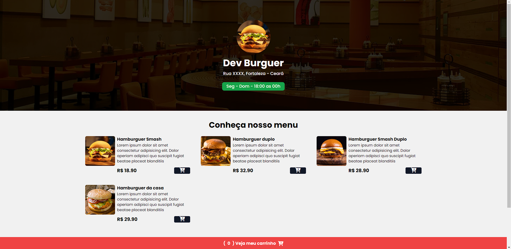
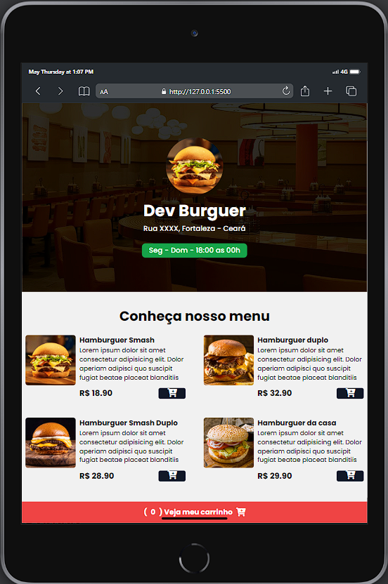
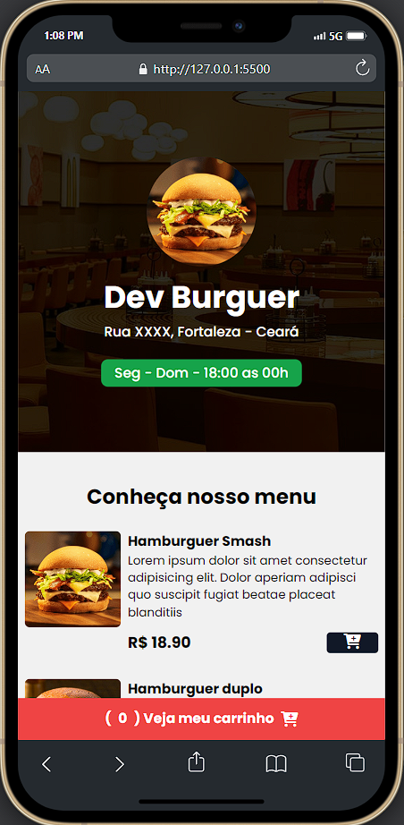

## DEV BURGER 🍔 (EN)

## About
Project online menu for on burger place, functional, where you can add to cart and make your purchase in this store and where are you sent to the store whatsapp.

## Technologies

## Screenshots

    
    
    

 
 
 

## DEV BURGER 🍔 (PT-BR)

## Sobre
Projeto de menu online para uma hamburgueria, funcional, onde você pode adicionar itens ao carrinho e fazer sua compra nesta loja. Onde você é enviado para o WhatsApp da loja.

## Tecnologias

## Captura de telas

    
    
    

